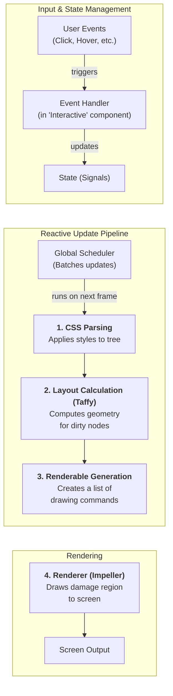

# MCTK - A High-Performance Rust UI Toolkit
MCTK is an opinionated, performance-first UI toolkit written in Rust. It is primarily being developed to build the MCTK Launcher and other applications for low-performance devices.The toolkit's API is heavily inspired by Flutter's declarative widget system, aiming to provide a familiar and productive developer experience. By adopting a tried and tested API design, we can focus on a robust implementation tailored to our specific hardware and performance needs.
## Core Architecture
MCTK uses a reactive, signal-based architecture to drive incremental updates to the UI. The core philosophy is to do as little work as possible on each frame, ensuring a smooth experience even on constrained hardware.

The rendering pipeline follows these steps:
1. **Styling**: A CSS parser applies styling rules to the component tree.
2. **Layout Calculation**: The Taffy crate computes the layout for all components that need updates.
3. **Renderable Generation**: The layout tree is traversed to create a list of platform-agnostic drawing commands.
4. **Rendering**: The drawing commands are sent to Impeller. We chose Impeller for its modern architecture and its ability to target older graphics APIs. This is critical for maintaining compatibility with devices that have limited driver support, such as the Mecha Comet which relies on EtnaViv for OpenGL ES 2.1.
## Key Principles
- **Flutter-Inspired API**: We aim to match Flutter's API for widget creation and drawing to a reasonable extent. This provides a familiar mental model and leverages a mature, well-designed API.
- **Performance-First**: Through fine-grained reactivity with signals and a hash-based dirty-tracking mechanism, the toolkit is designed to perform minimal work, only re-rendering what has explicitly changed.
- **Reactive State Management**: State is managed through signals, which automatically and efficiently propagate changes through the component tree to trigger targeted updates.
- **Opinionated for a Purpose**: Because this library is purpose-built for the MCTK Launcher, it makes specific architectural choices that favor our use case, rather than trying to be a general-purpose UI library.
## References
- Impeller: https://docs.flutter.dev/perf/impeller
- Impellers (Rust Bindings): https://github.com/coderedart/impellers
- Taffy: https://github.com/DioxusLabs/taffy